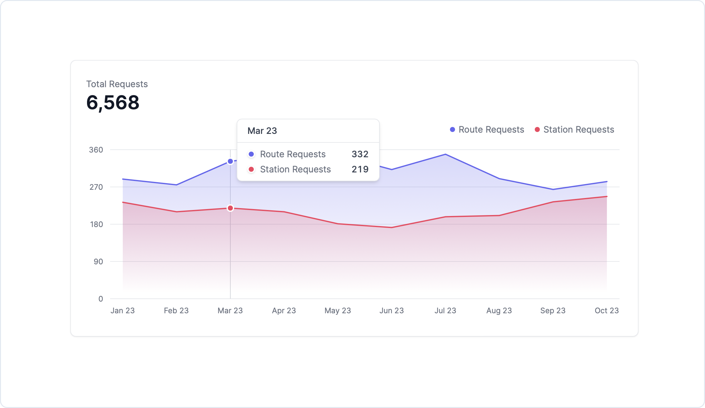

<br />
<br />
<p align="center">
  <a href="https://bellhop-ui.vercel.app">
    <picture>
       <source media="(prefers-color-scheme: dark)" srcset="images/bellhop-logo-dark.svg">
      <source media="(prefers-color-scheme: light)" srcset="images/bellhop-logo-light.svg">
    
    </picture>
  </a>
</p>
<div align="center">
<br />
<br />

<div align="center">
  <a href="https://npmjs.com/package/@bellhop">
    
  </a>
  <a href="https://actabl.slack.com/archives/C05UD2LARQF">
    
  </a>
</div>
<h3 align="center">
  <a href="https://bellhop-ui.vercel.app">Documentation</a> &bull;
  <a href="https://bellhop-ui.vercel.app">Website</a>
</h3>
<br />
  <h1>React components to build charts and dashboards</h1>
</div>

The [bellhop-ui](https://github.com/actabl-pdesign/bellhop-ui) contains 20+ components built on top of Tailwind CSS to make visualizing data simple.

## Getting Started

See our [Installation Guide](https://github.com/actabl-pdesign/bellhop-ui). To make use of the library we also need Tailwind CSS setup in the project.

## Example

Creating an analytical interface with bellhop-ui.

```jsx
"use client";
import { AreaChart, Card } from "@actabl-pdesign/bellhop-ui";

const chartdata = [
  {
    date: "Jan 23",
    "Route Requests": 289,
    "Station Requests": 233,
  },
  // ...
  {
    date: "Oct 23",
    "Route Requests": 283,
    "Station Requests": 247,
  },
];

export default function Example() {
  return (
    <Card className="max-w-4xl">
      <span className="text-bellhop-default text-bellhop-content dark:text-dark-bellhop-content">
        Total Requests
      </span>
      <p className="text-bellhop-metric font-semibold text-bellhop-content-strong dark:text-dark-bellhop-content-strong">
        6,568
      </p>
      <AreaChart
        className="mt-2 h-80"
        data={chartdata}
        index="date"
        categories={["Route Requests", "Station Requests"]}
        colors={["indigo", "rose"]}
        yAxisWidth={33}
      />
    </Card>
  );
}
```

<br />

<picture>
  <source media="(prefers-color-scheme: dark)" srcset="images/example-dark.png">
  <source media="(prefers-color-scheme: light)" srcset="images/example-light.png">
  
</picture>


## License

[Apache License 2.0](https://github.com/bellhoplabs/bellhop-npm/blob/main/License)

Copyright &copy; 2025 Actabl, All rights reserved.
